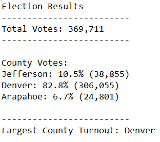
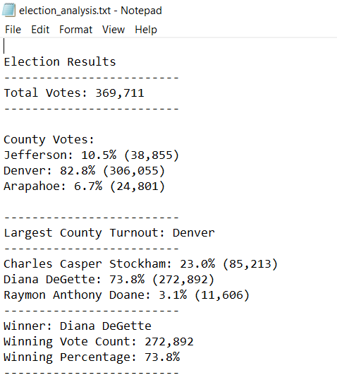

# Election Report with Python

## Overview of Election Audit

### Background

Python is often used task automation, data analysis, and data visualization, so the the project refers to analyze election results. Tom and Seth Steve are requiring a report to analyze an entire dataset to develop an audit process required by the Colorado Board of Elections. The data consists of a number for the ballot ID and a name for the county and candidate, respectively. After an initial analysis, additional information is required by election comission to complete the audit process.

### Purpose

The main purpose of this project is provide additional information, specifically about the voter turnout for each county, the percentage of votes from each county out of the total count and the county with the highest turnout for the election. The start point is working from the election_results.csv file, use for loops and conditional statements with membership and logical operators to find the requested results. Then, print the results to the command line and save them to the election_results.txt file. All this, in order to demostrate that the new results and the methods utilized are acording with the standards required for the election and audit process. 

## Election - Audit Results

To obtained the election results, a code was developed using Python. First, two dependencies were added using the code: "import csv" and "import os" to import data from specific files. 
 
Also, the code os.chdir(os.path.dirname(os.path.realpath(__file__))) to change Python's working directory to the folder containing the current Python file. 
 
In the same way, a variable was added to load a file from a path using the code file_to_load = os.path.join("Resources", "election_results.csv") and a variable was added  to save the file to a path: file_to_save = os.path.join("analysis", "election_analysis.txt"), all this based on the specific locations of both files. 

### County Election Results

In order to develop the calculation of the results for the county vote, and after the set up described previously, a variable called total_votes was initialized to zero, in order to use it as a counter for the votes. In the same way, a list of counties and county votes dictionary was created using the code:

county_options = []

county_votes = {}

Also, to track the largest county and county voter turnout two variables (one str and one int) were created using:

winning_county = "" 

winning_count_county = 0

Then, in order to extract the county name from each row a variable was declared as county_name = row[1]; having the second row in the data file as the corresponding to the county name. In this way, the next step is focused to write an if statement that checks that the county does not match any existing county in the county list and add the existing county to the list of counties, begining the tracking of the county's votes count (county_votes) as zero using the code below:

        if county_name not in county_options
        county_options.append(county_name)
        county_votes[county_name] = 0

Next step is add a vote to the county count (county_votes) cosidering the counting name in the list and add 1 vote using the code: 

    county_votes[county_name] += 1. 

Then, a "for loop" was created to get the county from the county dictionary and retrieve the vote count based on the specific county name using the code:

    for county_name in county_votes:
    votes_county = county_votes.get(county_name)

Further, a calculation was required to determine the percentage of votes for each county, considering the total votes already calculated in the previous version of the coding using:

    total_votes = total_votes + 1 for each row. 

It is important to mentioned the use of the "float fuction" to convert an integer or a string to a floating-point value. Basically, the formula is considering the total votes per county over the total votes in the election and multipliying per 100 to obtain the percentage of votes by county as shows the code below:

    vote_county_percentage = float(votes_county) / float(total_votes) * 100

Also, a variable called county_ results was created to store the values for county name, percentage by county and total votes in brackets to be printed later in the coding process. This was developed using the code below, considering also the formating and structure of the results in case an specific value need to be reflected using "%" or () as text, or having values in the next line using the print fuction:

    county_results = (
            f"{county_name}: {vote_county_percentage:.1f}% ({votes_county:,})\n")

    print(county_results)

Then, an if statement to determine the winning county and get its vote count was created using:

        if (votes_county > winning_count_county):
            winning_count_county = votes_county
            winning_county = county_name

For the code show previosuly, it is important to mention that the condition to guarantee the county with the major count will be considering, ensuring that the votes_county is greater than winning_county. At the end of the loop, the county with the major count will be strored, being possible assign the variable winning_count_county to stored the total count of votes and winning_county for the specific name. 

Some litmitation could be describe for this code, considering that in the hypotesis that two counties have exactly the same vote count, just the first county stored in the variable will be determined as the winner. Since, this condition is out of the scope, it was not covered in the coding process, but more conditionals could be add in the coding to guarantee the reflection of a "tie" result based on the vote count. 

Finally, to print the county with the largest turnout to the terminal the following code was use: 

    winning_county_summary = (
        f" \n"
        f"-------------------------\n"
        f"Largest County Turnout: {winning_county}\n"
        f"-------------------------\n")
    print(winning_county_summary)

This structure was developed to have a line that divide the results with the previous count already printed and also having as a text "Largest County Turnout: " and the winning county already identify in the calculation explained previously. 

The last step in the process is to save the county with the largest turnout to a text file using the code txt_file.write(winning_county_summary). As it shows the image below, the results of the election based on the coding process, also including the results by candidates already calculate in the previous code developed during the study of the Module could be transfer to a text file in order to obtaing automated results as a text in a separate file, providing simple information that cpuld be analyze for the audting purposes of the elections by the Colorado Comission.

### Candidates Election Results 

Additionally, it is important to mentioned that other critical values as total votes by candidate, percentage of votes by candidates, winner candidate and winner percentage were already in the code during the development of the module as follow below:

Creating a Candidate Options and candidate votes using a list and a dictionary:
    
    candidate_options = []
    candidate_votes = {}

Tracking the winning candidate, vote count and percentage declaring variables as str and int as follows:

    winning_candidate = ""
    winning_count = 0
    winning_percentage = 0

Reading the cvs and converting it into a list of dictionary and reading the header for each row in the cvs file and adding one aditional vote to the total count and getting the candidate name from the third positions in the data set under variable candidate_name; as shows below:

    with open(file_to_load) as election_data:
        reader = csv.reader(election_data)

        header = next(reader)
        
        for row in reader:
            total_votes = total_votes + 1
            candidate_name = row[2]

Furthermore, if the candidate If the candidate does not match any existing candidate add it to using the append function. In the same way, tracking the candidate's vote with the variable candidate_votes to the voters count (initialized in zero) and printing the final value before adding a new vote to the count as follow the code below:

    if candidate_name not in candidate_options:
        candidate_options.append(candidate_name)
        candidate_votes[candidate_name] = 0
        print(candidate_votes)
    candidate_votes[candidate_name] += 1

In the same way, saving the result in the same text file and printing it in the terminal using the standard format define by each line as 

    with open(file_to_save, 'w') as txt_file:

        election_results = (
            f"\nElection Results\n"
            f"-------------------------\n"
            f"Total Votes: {total_votes:,}\n"
            f"-------------------------\n\n"

            f"County Votes:\n")
        print(election_results, end="")

        txt_file.write(election_results)

Also, to save the final candidate vote count to the text file, and print each candidate's voter count and percentage to the terminal. The code used was: 
    
    for candidate_name in candidate_votes:

To retrieve vote count and percentage a similar formula like showed previously for the county was developed considering the votes by candidate (using the get function) and dividing the votes by each candidate with the total votes registered in the election (using in the same way the float function and multipling by 100):

        votes = candidate_votes.get(candidate_name)
        vote_percentage = float(votes) / float(total_votes) * 100
        candidate_results = (
            f"{candidate_name}: {vote_percentage:.1f}% ({votes:,})\n")

        print(candidate_results)
        #  Save the candidate results to our text file.
        txt_file.write(candidate_results)

About, to determine winning vote count, winning percentage, and candidate an If statement was used to guarantee the winning count will hold the highest vote count in the loop as follow below:

        if (votes > winning_count) and (vote_percentage > winning_percentage):
            winning_count = votes
            winning_candidate = candidate_name
            winning_percentage = vote_percentage

Finally printing the winning candidate (to terminal)
    
    winning_candidate_summary = (
        f"-------------------------\n"
        f"Winner: {winning_candidate}\n"
        f"Winning Vote Count: {winning_count:,}\n"
        f"Winning Percentage: {winning_percentage:.1f}%\n"
        f"-------------------------\n")
    print(winning_candidate_summary)

And saving the winning candidate's name to the text file

    txt_file.write(winning_candidate_summary)

### Conclusion for the Election Results

In conclusion, a total of 369,711 total votes were cast in this congressional election. The breakdown of the number of votes and the percentage of the total votes for each county in the precinct was obtained as: 

    County Votes:
    Jefferson: 10.5% (38,855)
    Denver: 82.8% (306,055)
    Arapahoe: 6.7% (24,801)

Reflecting also, that the county with the largest number of votes is 

    Largest County Turnout: Denver

Additionally, as previous calculated, the breakdown of the number of votes and the percentage of the total votes each candidate received was determined as 

    Charles Casper Stockham: 23.0% (85,213)
    Diana DeGette: 73.8% (272,892)
    Raymon Anthony Doane: 3.1% (11,606)

Finally, the candidate Diana DeGette won the election with a vote count of 272,892 votes and a total percentage 73.8% of the total votes 

    Winner: Diana DeGette
    Winning Vote Count: 272,892
    Winning Percentage: 73.8%

All these results have been write in the text file (txt_file) created for this purpose as the image below shows:

## Election - Audit Summary

In summary, the script describe before represents a versatile tool easy to develop in order to guarantee the analysis in the results of the election by any Electoral Commission. Some of the advantages of the code used include that any variable relate with the name of candidates and any other territorial breakdown as Municipalities, States, etc can be account to calculate the results studied. It is just necesary make simple changes as a new declaration of candidates, states, or other variable in the script to update the dictionary and the list utilized, keeping the structure for the calculation utilizing the fuctions studies as for loops, or if statements and having the same writing over a txt file. An example of this having specifics states for a congress election could include:

    State_options = []
    State_votes = {}

        if state_name not in state_options:

            # Add the existing county to the list of counties.
            state_options.append(state_name)

            # Begin tracking the county's vote count.
            state_votes[state_name] = 0

            # Add a vote to that county's vote count.
            state_votes[state_name] += 1

In the same way, it is possible to analyze a different data under the same structure to run the script, just changing the module that are imported in the variable to load the data using the os.path.join (file). Another example, could include the following code to import presidential results from an specific folder as:

To add a variable to load a file from a path.

    file_to_load = os.path.join("Resources", "presidential_results.csv")

To add a variable to save the file to a path.

    file_to_save = os.path.join("analysis", "presidential_analysis.txt")

And also adapting the code to the structure of the data, changing the number of the row for a declared variable, where the specific data (candidate name, or state) is located, the analysis could be adapted to any type of data. An example of this change include:

    row_candidate_number = 2
    row_state_number= 3

    candidate_name = row[row_candidate_number]
    state_name = row[row_state_number]

Where the number value of the variables row_candidate_number and row_state_number can be easily modified for future reference adapting to a new data set. 

In conclusion, this script is standard with a really easy to pickup and learn, improving productiving in any audit process in the election; also being the base for web app development. It offers many advantages, with simplicity and flexibility being the main reason for Python’s rise in popularity. Also, it is possible state that the script could be use as shown, with similar election results, providing a suitable tool for other Election Comissions to adapt the results to a possible audit process. 
